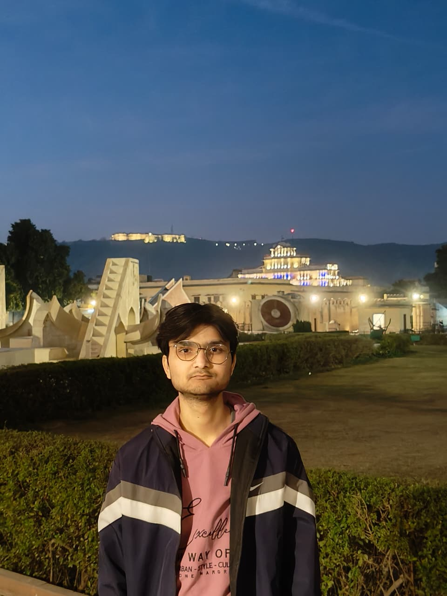
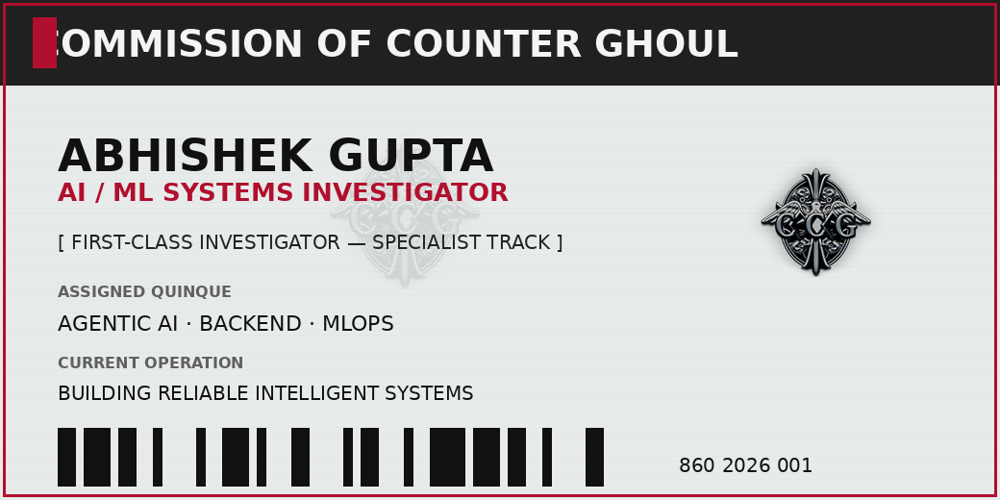
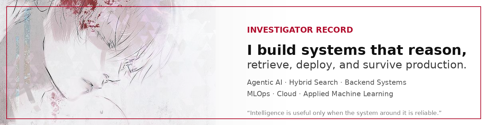
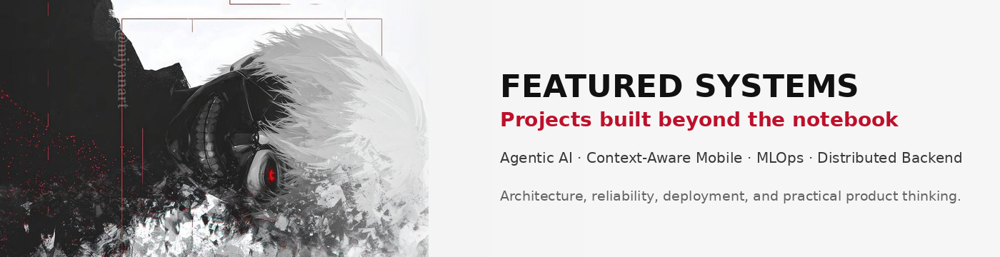
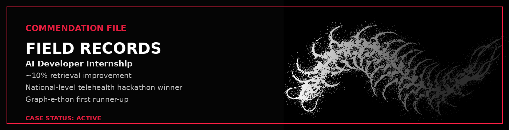
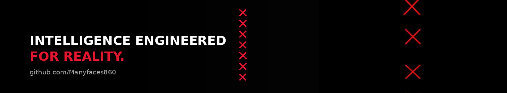

<table>
<tr>
<td width="32%" align="center" valign="middle">
  
</td>
<td width="68%" align="center" valign="middle">
  
</td>
</tr>
</table>

<p align="center">
  
</p>

<p align="center">
  
  <a href="https://www.linkedin.com/in/abhishek-gupta-ab377b305/">
    
  </a>
  <a href="https://architect-ai.itsfolio.tech/">
    
  </a>
  <a href="https://www.kaggle.com/abhishekgupta36">
    
  </a>
</p>

---

<p align="center">
  
</p>

## 🗂️ Investigator Record

<table>
<tr>
<td width="64%" valign="top">

I am **Abhishek Gupta**, a **2026 B.Tech CSE graduate specializing in AI/ML**, focused on building intelligent systems that move beyond experiments and into real applications.

My investigations focus on:

- **Agentic AI and RAG** — hybrid retrieval, guardrails, tools, structured outputs, and observability
- **Backend engineering** — FastAPI, Spring Boot, MongoDB, PostgreSQL, and Redis
- **MLOps and cloud** — Docker, Airflow, MLflow, DVC, GitHub Actions, AWS, GCP, and Terraform
- **Applied machine learning** — PyTorch, TensorFlow, Hugging Face, and Scikit-learn

During my **AI Developer Internship at Horizon by Ovalon**, I worked on agentic RAG systems, hybrid search pipelines, and retrieval optimization, improving retrieval performance by approximately **10%** while contributing to Docker-, Airflow-, and AWS-based workflows.

</td>
<td width="36%" valign="top">

### Assigned Division

```text
Artificial Intelligence
Backend Operations
MLOps Infrastructure
Retrieval Intelligence
```

### Current Rank Target

```text
AI/ML Engineer
Backend Engineer
GenAI Engineer
MLOps Engineer
Applied AI Engineer
```

</td>
</tr>
</table>

---

<p align="center">
  
</p>

## ⚔️ Quinque Arsenal

<table>
<tr>
<td width="50%" valign="top">

### Type: Retrieval & Agent Systems

<p>
  
  
  
  
  
  
  
</p>

### Type: Backend Operations

<p>
  
  
  
  
  
</p>

</td>
<td width="50%" valign="top">

### Type: Machine Intelligence

<p>
  
  
  
  
</p>

### Type: Deployment & Surveillance

<p>
  
  
  
  
  
  
  
</p>

</td>
</tr>
</table>

---

<p align="center">
  
</p>

## 🎯 Assigned Operations

<table>
<tr>
<td width="50%" valign="top">

### [Operation: Refund Sentinel](https://github.com/Manyfaces860/end_to_end_refund_agent)

A production-oriented refund decision system combining agentic reasoning, hybrid policy retrieval, structured outputs, guardrails, conversation state, and observability.

- OpenAI Agents SDK with tool-based workflows
- Pinecone hybrid retrieval
- MongoDB and Redis session state
- Langfuse and OpenTelemetry tracing
- Next.js frontend and FastAPI backend

<a href="https://drive.google.com/file/d/1IsBMHvM7bE1eF3cGJreJt_27cZf64qxC/view?usp=sharing">
  
</a>

</td>
<td width="50%" valign="top">

### [Operation: TimeSphere](https://github.com/Manyfaces860/timesphere)

A context-aware mobile task manager designed to surface the right task based on time, routine, location, device, and energy.

- Expo React Native and TypeScript
- Native Android Kotlin module
- routine-based context resolution
- manual context and energy overrides
- context-filtered “Right Now” feed

</td>
</tr>

<tr>
<td width="50%" valign="top">

### [Operation: Fraud Watch](https://github.com/Manyfaces860/ETE_MLOps_Credit_Card_Fraud_Prediction)

An end-to-end fraud detection platform covering orchestration, drift checks, experiment tracking, serving, monitoring, and AWS deployment.

- Airflow ETL and training DAGs
- DVC artifact versioning
- MLflow experiment tracking
- Prometheus and Grafana monitoring
- GitHub Actions → ECR → EC2

</td>
<td width="50%" valign="top">

### [Operation: Fragment Vault](https://github.com/Manyfaces860/distributed_file_storage_system)

A Spring Boot backend that chunks files, distributes them across PostgreSQL-backed nodes, tracks metadata, and reconstructs the original file.

- file chunking and reassembly
- multi-node storage
- metadata-driven retrieval
- Spring Data JPA and Hibernate
- Swagger/OpenAPI

</td>
</tr>
</table>

---

## 🗃️ Secondary Case Files

- [Chest CT Cancer Classification MLOps](https://github.com/Manyfaces860/ETE_MLOps_DeepL_Cancer_Prediction)
- [Reddit Comment Sentiment Analysis](https://github.com/Manyfaces860/Reddit_comments_sentiment_analysis_using_bert_finetuned)
- Visa Approval Prediction System
- [Decentralized Chat Application](https://github.com/Manyfaces860/decentralised_chatapp)

---

<p align="center">
  
</p>

## 🏅 Commendations

<table>
<tr>
<td width="25%" align="center"><b>AI Developer Internship</b><br/>Agentic RAG and hybrid search</td>
<td width="25%" align="center"><b>~10% Retrieval Improvement</b><br/>Search and ranking optimization</td>
<td width="25%" align="center"><b>Hackathon Winner</b><br/>National-level Telehealth project</td>
<td width="25%" align="center"><b>First Runner-up</b><br/>Graph-e-thon</td>
<td width="25%" align="center"><b>Finalist</b><br/>IEEE 2025 Hackathon</td>
</tr>
</table>

---

## 📊 Investigation Statistics

<table>
<tr>
<td width="50%" align="center">
  
</td>
<td width="50%" align="center">
  
</td>
</tr>
</table>

<p align="center">
  
</p>

---

## 🧵 Field Activity Trace

<p align="center">
  
</p>

---

## 📡 CCG Communication Channels

<p align="center">
  <a href="https://www.linkedin.com/in/abhishek-gupta-ab377b305/">
    
  </a>
  <a href="https://architect-ai.itsfolio.tech/">
    
  </a>
  <a href="https://www.kaggle.com/abhishekgupta36">
    
  </a>
</p>

<p align="center">
  
</p>
